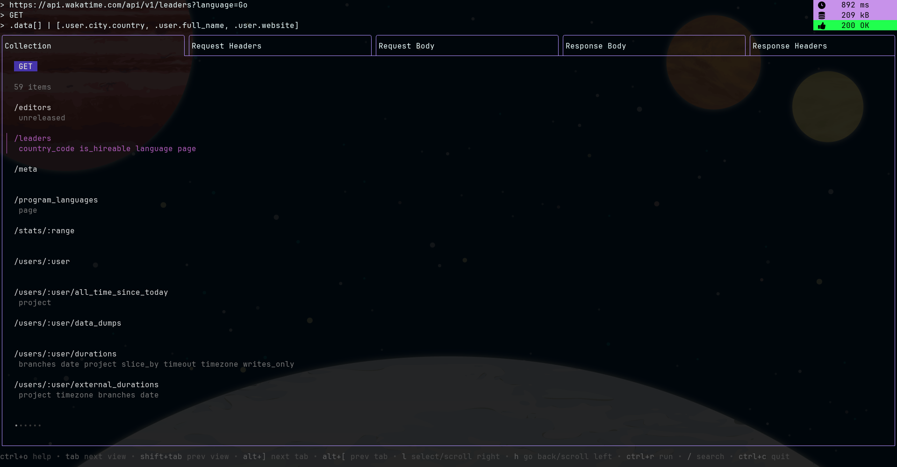

# 🌑 PosTUI




Terminal User Interface for testing API requests written in [Golang](https://go.dev/).

Using the [bubbletea](https://github.com/charmbracelet/bubbletea) framework.

---

## 🌒 Table of Contents

- [Installation](#🌓-installation)
- [Features](#🌔-features)
- [Usage](#🌕-usage)
- [Options](#options)
- [Configuration](#configuration)
- [UI Components](#ui-components)
- [Default Keybindings](#default-keybindings)

## 🌓 Installation

`go install github.com/bramca/postui/cmd/postui@latest`

or check out the [releases](https://github.com/bramca/postui/releases)

## 🌔 Features

- Never leave your keyboard with *vim* like navigation and keybindings
- Save your requests in a collection *json* file
- Group collections in a directory and navigate them through the TUI
- Configure custom colors and keybindings
- Edit your collection *json* in **edit** mode
- Quickstart your collection by providing an OpenAPI specification
- Set headers using *env* variables with bracket expansion (e.g. {{ENV_VAR}})
- Parse / transform response output with *jq* query
- Search for text in your collection or in the response
- Copy current requests *curl* command

## 🌕 Usage

`postui -f <collection.json>`

or

`postui -s <openapi-spec.yaml> -v <spec version>`

or

`postui -d <collection directory>`

or

`postui`

### Options
- `-specfile, -s [optional]`
    * path to your openapi specification file
<br><br>
- `-specversion, -v [optional]`
    * specify the major version of your spec
    * values: 2, 3
<br><br>
- `-collectionfile, -f [optional]`
    * path to api collection file
<br><br>
- `-collectiondir, -d [optional]`
    * path to api collection directory
<br><br>
- `-skiptlsverify, -t [optional]`
    * skip TLS verification
    * **WARNING**: this is insecure, should be only used for testing purposes

When no options are provided it will by default look at the directory `~/.config/postui/collections/`.

Any new collections started and saved will by default be written to that directory.

This default directory is overwritable in the configuration (see next section).

### Configuration

You can provide custom configuration in a `~/.config/postui/config.json` file to override the defaults.

Example configurable options:
```json
{
  "default-collection-dir": "~/.config/postui/collections",
  "default-keybindings": {
    "help": "ctrl+o",
    "nextView": "tab",
    "prevView": "shift+tab",
    "nextTab": "alt+]",
    "prevTab": "alt+[",
    "up": "ctrl+k",
    "down": "ctrl+j",
    "left": "ctrl+h",
    "right": "ctrl+l",
    "scrollUpMulti": "ctrl+b",
    "scrollDownMulti": "ctrl+f",
    "goDown": "j",
    "goUp": "k",
    "goForward": "l",
    "goBack": "h",
    "top": "g",
    "bottom": "G",
    "paste": "ctrl+v",
    "copy": "alt+c",
    "copyCurl": "alt+x",
    "save": "ctrl+s",
    "run": "ctrl+r",
    "addCollection": "alt+a",
    "focusCollection": "alt+l",
    "focusResponse": "alt+b",
    "search": "/",
    "searchNext": "ctrl+n",
    "searchPrev": "ctrl+p",
    "searchStop": "alt+/",
    "toggleCollectionEdit": "ctrl+t",
    "reloadConfig": "alt+r",
    "quit": "ctrl+c"
  },
  "default-colors": {
    "highlight-colors": {
      "Light": "#82aaff",
      "Dark": "#B191FF"
    },
    "non-highlight-colors": {
      "Light": "#B5B5B5",
      "Dark": "#535353"
    },
    "response-time-colors": {
      "Light": "#72acff",
      "Dark": "#c792ea"
    },
    "response-size-colors": {
      "Light": "#72acff",
      "Dark": "#c792ea"
    },
    "collection-list-title-colors": {
      "Light": "#1a2c79",
      "Dark": "#4535aa"
    },
    "collection-list-active-colors": {
      "Light": "#527cbc",
      "Dark": "#b05cba"
    },
    "collection-list-filter-prompt-colors": {
      "Light": "#33539e",
      "Dark": "#ed639e"
    }
  }
}
```

### UI Components

The TUI consists of two main **views**:

- The **Top** view with inputs such as request url, request method and optional *jq* query

- The **Bottom** view with multiple tabs: `Collection`, `Request Headers`, `Request Body`, `Response Body`, `Response Headers`

And one toggleable view (ref. [keybindings](#default-keybindings)):

- The **Search** view with an input field to find text in the response body or response headers

### Default Keybindings
help:
- `ctrl+o`
    * show all keybindings

view navigation:
- `tab`
    * next view (go to top or bottom view)
- `shift+tab`
    * previous view (go to top or bottom view)
- `alt+]`
    * next tab in view
- `alt+[`
    * previous tab in view
- `up/k`
    * go up
- `down/j`
    * go down
- `h`
    * scroll left
    * go back in collection list selection
- `l`
    * scroll right
    * select item in collection list
- `ctrl+b`
    * scroll up multiple lines
- `ctrl+f`
    * scroll down multiple lines
- `g`
    * scroll to the top
- `G`
    * scroll to the bottom
- `ctrl+k`
    * move cursor up in edit mode
- `ctrl+j`
    * move cursor down in edit mode
- `ctrl+h`
    * move cursor left in edit mode
- `ctrl+l`
    * move cursor right in edit mode

actions:
- `ctrl+r`
    * run current API request
- `alt+a`
    * add current request to collection
- `alt+c`
    * copy view content to clipboard
- `ctrl+v`
    * clipboard paste
- `ctrl+s`
    * save current collection
- `alt+r`
    * reload configuration
- `alt+x`
    * copy current requests curl command
- `ctrl+c`
    * quit application
- `ctrl+t`
    * toggle collection edit mode
- `alt+l`
    * focus on collection view
- `alt+b`
    * focus on response view
- `/`
    * search for text
- `ctrl+n`
    * go to next search match (when search is active)
- `ctrl+p`
    * go to previous search match (when search is active)
- `alt+/`
    * stop search
